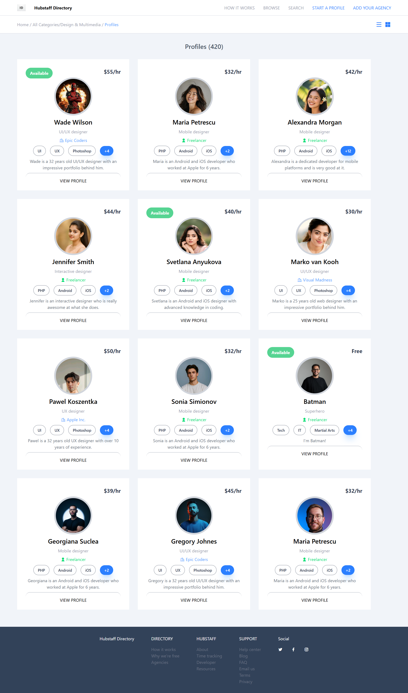

# Static Card Website Using React

- **Live Demo:** [https://react7card.netlify.app/](https://react7card.netlify.app/)
- **Source Code:** [https://github.com/Dileep-kumawat/Static-card-website-using-react](https://github.com/Dileep-kumawat/Static-card-website-using-react)

A clean, static card-based UI built with React for showcasing items (skills/features/products/whatever you choose to put in cards) with responsive layout and easy extensibility.

---

## 📸 Preview



---

## 🚀 Project Overview

This is a **React front-end project** that renders a set of static cards - each displaying an image, title, description, and optionally a link or button. It’s built for clarity, not complexity: no backend, no API calls, just React + CSS + simple logic.

👉 Ideal for portfolios, landing sections, product previews, team showcases, etc.

---

## 📦 Features

* Simple, responsive card layout
* Built with reusable React components
* Easy data structure (JSON/array) for cards
* Deployed live on Netlify
* Light styling - easy to replace with Tailwind / Material UI / Styled-Components
* No dependencies beyond React ecosystem

---

## 🧠 Tech Stack

| Technology                  | Purpose                                           |                     
| --------------------------- | ------------------------------------------------- |
| **React**                   | UI library for building component-based front end |                     
| **tailwindCSS**             | Styling and responsive layout                     |                     
| **Vite / Create React App** | Project scaffolding and build tooling             |                     
| **Netlify**                 | Continuous deployment and hosting                 | 

---

## 🗂️ Folder Structure

```
/public
  index.html
/src
  /components
    Card.jsx
    CardList.jsx
  App.jsx
  index.js
.gitignore
package.json
README.md
```

* **`Card` component** - represents a single card.
* **`CardList` / parent container** - maps data and renders cards.
* **`App`** - root component.

---

## 📌 How It Works

1. **Component-Based UI**
   You declare card data (array of objects), then map it to individual `<Card />` components.

2. **Static Data Source**
   No API calls — the data lives in a local JS/JSON file → perfect for static pages.

3. **Responsive Layout**
   Uses CSS flex/grid to keep cards looking good on mobile and desktop.

This approach is simple and scalable for a static front-end. If you later need interaction or routing, it’s trivial to extend.

---

## 💻 Installation

Clone the repo:

```bash
git clone https://github.com/Dileep-kumawat/Static-card-website-using-react.git
cd Static-card-website-using-react
```

Install dependencies:

```bash
npm install
```

Start dev server:

```bash
npm start
```

Build for production:

```bash
npm run build
```

---

## 📋 Example Card Data

Here’s how your card data might look:

```js
const cards = [
  {
    id: 1,
    title: "Awesome Feature",
    description: "A brief description here.",
    imageUrl: "/images/feature1.png",
    link: "https://example.com"
  },
  ...
];
```

This pattern keeps content separate from UI logic.

---

## 🧑‍💻 Who Built This

Made with ❤️ by **Dileep kumawat** - React enthusiast sharpening front-end skills.
- GitHub: [https://github.com/Dileep-kumawat](https://github.com/Dileep-kumawat)
- 📧 [dileepkumawat525@gmail.com](mailto:dileepkumawat525@gmail.com)
- 🔗 [LinkedIn](https://www.linkedin.com/in/dileep-kumawat/)

---

## 📜 License

MIT © 2025